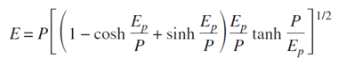
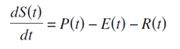
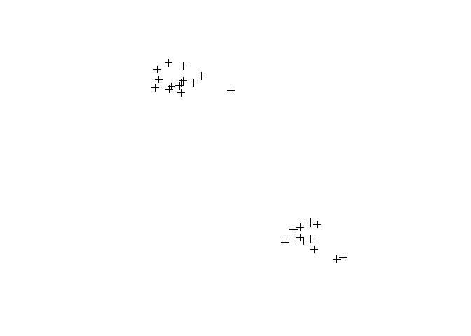
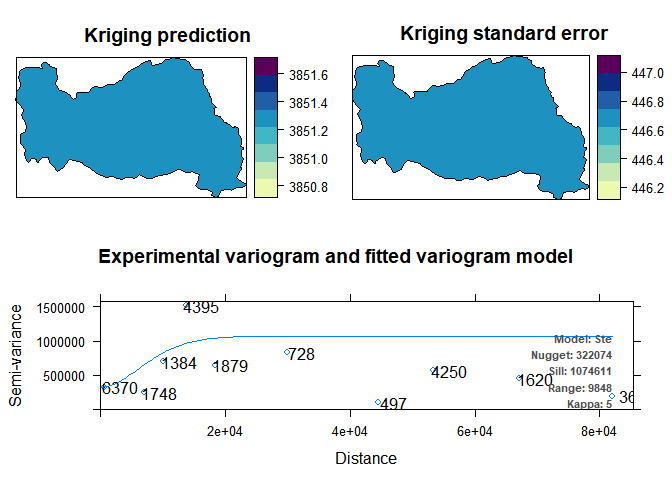
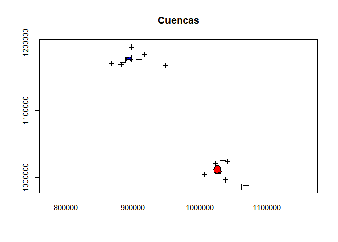

Aplicación del escalamiento estadístico en la estimación del caudal de
tres cuencas
================
David Triviño

El escalamiento estadístico es usado con el fin de entender las
propiedades emergentes de procesos hidrológicos en diferentes escalas
espacio-temporales (Salazar y Poveda 2008). Por otro lado, es el
respaldo metodológico para el balance de la ecuación a largo tiempo de
flujos de agua, para abordar el problema “PUB” (Prediction ungauged
basins) en una escala de tiempo de interés *(Poveda et al. 2007)*.

Basado en la teoría clásica de cuantiles y en combinación con las ideas
de escala se puede estimar caudales extremos a diferentes periodos de
retorno (Chow 1951). Según Gupta y Waymire (1990) hay una relación clara
entre el caudal medio y los flujos extremos con el área de drenaje.

El presente trabajo, busca en general aplicar el escalamiento
estadístico para la estimación de caudales en tres cuencas, durante el
periodo de 1980-2015. Por otro lado, estimar los caudales mínimos y
máximos. Y evaluar el desempeño del software R para el procesamiento de
datos y análisis estadístico.

En primera instancia se seleccionaron las tres cuencas a trabajar, la
Chorrera, Santa Bárbara y Rio Blanco. Las dos primeras ubicadas en el
municipio de San Carlos, en el departamento de Antioquia. La Chorrea con
un área de 1976 ha, y un rango altitudinal entre 2340 m y 980 m. Santa
Bárbara, cuenca que colinda al occidente con la Chorrera, posee una
extensión menor de 969.9 ha, se encuentra entre los 2386 y 1605 m.s.n.m.
Finalmente la cuenca del Rio Blanco se encuentra en el departamento de
Cundinamarca y hace parte del sistema de páramo de Chingaza, el área de
estudio de esta cuenta fue de 9609.582 ha.

Los datos climáticos fueron obtenidos de la Agencia Meteorológica de
Colombia (IDEAM). En total se emplearon 11 estaciones climáticas para la
obtención de la precipitación. Y 20 estaciones de para la temperatura.
Los datos obtenidos fueron mensuales en el periodo 1980-2015. Con el
software R, se realizó la interpolación de los datos de precipitación y
temperatura. Se empleó la ecuación de Thornthwaite (1948) para obtener
los datos de evapotranspiración potencial en función de la temperatura
media mensual. Luego, mediante la formulación de Budyko (1974) se obtuvo
los datos mensuales de la evaporación real.

<!-- -->

Posteriormente se realizó un balance hídrico propuesto por Manabe (1969), mediante la ecuación diferencial expuesta en:



### Paquetes utilizados

``` r
library(sp)
library(gstat)
library(rgdal)
require(automap)
library(maptools)
library(rgeos)
library(plyr)
```

### Datos

``` r
series<-read.csv2("series.csv")
preci<-subset(series,DATA=="PRECIP")
temp=subset(series,DATA=="TEMP")
```

``` r
for(i in 1:dim.data.frame(temp)[1]){
  temp$I[i]=sum((temp[i,3:14]^1.514)/(5^1.514))
}
head(temp)
```

    ##      ANO DEP   ENE   FEB   MAR   ABR   MAY   JUN   JUL   AGO   SEP   OCT   NOV
    ## 115 1977 ANT 16.63 18.03 16.53 17.13 17.03 17.23 17.10 16.80 16.70 17.20 16.73
    ## 116 1978 ANT 16.63 18.03 16.53 17.13 17.13 17.03 17.33 16.83 16.63 16.53 17.13
    ## 117 1979 ANT 16.43 17.23 17.23 17.60 17.33 17.03 16.83 16.83 16.93 16.83 16.63
    ## 118 1980 ANT 16.73 16.53 17.93 17.43 18.23 17.60 17.23 17.03 17.33 17.13 16.93
    ## 119 1981 ANT 16.23 17.33 17.13 17.28 17.33 17.13 16.73 16.83 17.08 16.98 16.88
    ## 120 1982 ANT 16.88 17.18 17.23 17.48 17.68 17.48 17.13 17.33 17.73 17.23 16.53
    ##       DIC    ANUAL    Y      X    Z DATA      ESTAT        I
    ## 115 16.73 16.98667 6.18 -75.15 1950 TEMP CORRIENTES 76.45616
    ## 116 16.73 16.97167 6.18 -75.15 1950 TEMP CORRIENTES 76.35585
    ## 117 16.23 16.92750 6.18 -75.15 1950 TEMP CORRIENTES 76.05219
    ## 118 16.53 17.21917 6.18 -75.15 1950 TEMP CORRIENTES 78.05619
    ## 119 16.93 16.98833 6.18 -75.15 1950 TEMP CORRIENTES 76.46105
    ## 120 17.03 17.24250 6.18 -75.15 1950 TEMP CORRIENTES 78.20108

### Thornwite en mm/mes

``` r
EvP<-function(t,i){
  I=i
  a=0.49+1.79e-2*I-7.71e-5*(I^2)+6.75e-7*(I^3)
  ep=16*(10*t/I)^a
  return(ep)
}
dim.data.frame(temp)
```

    ## [1] 1014   21

``` r
EP=data.frame()

for(i in 1:dim.data.frame(temp)[1]){
  for(j in 1:dim.data.frame(temp)[2]){
    if(j==1){
      EP[i,j]=temp$ANO[i]
    }
    if(j==2){
      EP[i,j]=temp$DEP[i]
    }
   if(j>2 & j<=14){
     EP[i,j]=EvP(temp[i,j],temp$I[i])
   }
    if(j==15){
      EP[i,j]=sum(EP[i,3:14])
    }
  if(j>15){
    EP[i,j]=temp[i,j]
   }
  }
}
colnames(EP)=colnames(temp)
head(EP)   
```

    ##    ANO DEP      ENE      FEB      MAR      ABR      MAY      JUN      JUL
    ## 1 1977 ANT 60.40301 69.35371 59.78340 63.54072 62.90791 64.17616 63.35060
    ## 2 1978 ANT 60.45399 69.40215 59.83450 63.59096 63.59096 62.95831 64.86411
    ## 3 1979 ANT 59.37279 64.37783 64.37783 66.74892 65.01517 63.11092 61.85442
    ## 4 1980 ANT 60.21534 58.96943 67.92159 64.66278 69.90945 65.76314 63.37836
    ## 5 1981 ANT 57.93799 64.81179 63.53827 64.49242 64.81179 63.53827 61.02279
    ## 6 1982 ANT 61.08407 62.98668 63.30619 64.91407 66.21271 64.91407 62.66785
    ##        AGO      SEP      OCT      NOV      DIC    ANUAL    Y      X    Z DATA
    ## 1 61.46243 60.83831 63.98525 61.02527 61.02527 751.8520 6.18 -75.15 1950 TEMP
    ## 2 61.70088 60.45399 59.83450 63.59096 61.07612 751.3514 6.18 -75.15 1950 TEMP
    ## 3 61.85442 62.48137 61.85442 60.60837 58.14773 749.8042 6.18 -75.15 1950 TEMP
    ## 4 62.10490 64.01920 62.74026 61.47229 58.96943 760.1262 6.18 -75.15 1950 TEMP
    ## 5 61.64770 63.22153 62.59002 61.96115 62.27525 751.8490 6.18 -75.15 1950 TEMP
    ## 6 63.94728 66.53908 63.30619 58.89584 62.03227 760.8063 6.18 -75.15 1950 TEMP
    ##        ESTAT        I
    ## 1 CORRIENTES 76.45616
    ## 2 CORRIENTES 76.35585
    ## 3 CORRIENTES 76.05219
    ## 4 CORRIENTES 78.05619
    ## 5 CORRIENTES 76.46105
    ## 6 CORRIENTES 78.20108

Evapotranspiración potencial

``` r
write.csv2(EP,"EP1.csv")
```

### Shapes de las cuencas

``` r
ching<-readOGR(".","CHING")
```

    ## OGR data source with driver: ESRI Shapefile 
    ## Source: "C:\Users\David Esteban\Google Drive\Materias cursadas\Geomática Aplicada\Trabajo final", layer: "CHING"
    ## with 1 features
    ## It has 13 fields

``` r
sc<-readOGR(".","SC")
```

    ## OGR data source with driver: ESRI Shapefile 
    ## Source: "C:\Users\David Esteban\Google Drive\Materias cursadas\Geomática Aplicada\Trabajo final", layer: "SC"
    ## with 1 features
    ## It has 6 fields

``` r
sb<-readOGR(".","SB")
```

    ## OGR data source with driver: ESRI Shapefile 
    ## Source: "C:\Users\David Esteban\Google Drive\Materias cursadas\Geomática Aplicada\Trabajo final", layer: "SB"
    ## with 1 features
    ## It has 6 fields

``` r
gArea(ching)/10000
```

    ## [1] 9609.582

### Georreferenciación de las bases de datos

``` r
coordinates(EP)<-~X+Y
crs.new<-proj4string(ching)
proj4string(EP)<-CRS("+init=epsg:4326")
EP<- spTransform(EP, crs.new)
```

``` r
coordinates(preci)<-~X+Y
proj4string(preci)<-CRS("+init=epsg:4326")
precip<- spTransform(preci, crs.new)
```

``` r
sub1=subset(precip)
krig1= autoKrige(ANUAL~1, sub1,sc)
```

``` r
plot(sub1)
```

<!-- -->

``` r
head(sub1)
```

    ##           coordinates  ANO DEP    ENE    FEB    MAR    ABR    MAY    JUN    JUL
    ## 1 (948805.6, 1167424) 1980 ANT 148.00  22.00  83.00 190.00 314.00 317.00 388.00
    ## 2 (948805.6, 1167424) 1981 ANT 118.00 179.00 137.00 391.00 681.00 387.00 235.78
    ## 3 (948805.6, 1167424) 1982 ANT 113.96 121.06 179.72 347.72 359.81 301.98 235.78
    ## 4 (948805.6, 1167424) 1983 ANT 129.20  45.20  74.80 431.40 373.40 238.50 329.40
    ## 5 (948805.6, 1167424) 1984 ANT 110.90 281.90  69.40 245.60 407.20 469.20 168.40
    ## 6 (948805.6, 1167424) 1985 ANT  41.80  98.70 258.40 212.30 335.20 105.00 167.50
    ##      AGO    SEP    OCT    NOV    DIC   ANUAL   Z   DATA ESTAT
    ## 1 477.00 431.00 430.00 334.00 168.00 3302.00 975 PRECIP PATIO
    ## 2 331.89 452.32 428.23 302.62 173.33 3817.17 975 PRECIP PATIO
    ## 3 331.89 426.74 428.23 156.13 156.60 3159.62 975 PRECIP PATIO
    ## 4 207.30 524.80 449.70 341.60 224.50 3369.80 975 PRECIP PATIO
    ## 5 518.10 467.20 533.40 370.00 223.70 3865.00 975 PRECIP PATIO
    ## 6 429.40 425.90 216.00 146.90  89.00 2526.10 975 PRECIP PATIO

``` r
plot(krig1)
```

<!-- -->

``` r
{plot(sub1, axes=TRUE, main="Cuencas", cex.axis=.95)
plot(sc, col="blue", add=T)
plot(sb,col="green", add=T)
plot(ching,col="red",add=T)}
```

<!-- -->

``` r
head(sub1@data[1])
```

    ##    ANO
    ## 1 1980
    ## 2 1981
    ## 3 1982
    ## 4 1983
    ## 5 1984
    ## 6 1985

``` r
names(sub1)[1:14]
```

    ##  [1] "ANO" "DEP" "ENE" "FEB" "MAR" "ABR" "MAY" "JUN" "JUL" "AGO" "SEP" "OCT"
    ## [13] "NOV" "DIC"

Función de interpolación, dado los datos, el shape de salida, la formula
con la que se maneja el kriging, y variable del departamento.

``` r
interpol<-function(data, shape,tempo, Departamento){
  sub1=subset(data, DEP==Departamento)
  t=length(tempo)
  interpol=data.frame()
  for(i in 1:t){
    sub=subset(sub1,ANO==c(0,tempo[i]))
    nombre=names(sub)
    for(j in 1:14){
      if(j<3){
        interpol[i,j]=sub@data[i,j]
      }else{
        form=as.formula(paste(nombre[j],"~","1"))
       krig= autoKrige(form, sub, shape)
       interpol[i,j]=krig$krige_output@data$var1.pred
      }
    }
  }
  colnames(interpol)=names(sub1)[1:14]
  return(interpol)
}
```

### Ecuación Budyko (1974)

``` r
Eva=function(ep,p){
  e=sqrt(((ep*p)*tanh(p/ep))*(1-cosh(ep/p)+sinh(ep/p)))
}
```

## Cuenca de San Carlos

``` r
tempo=seq(1980,2015, 1)
scEP<-interpol(EP,sc,tempo,"ANT")
```

    ## Error in vgm_list[[which.min(SSerr_list)]]: attempt to select less than one element in get1index

``` r
scP<-interpol(precip,sc,tempo,"ANT")
```

    ## Error in vgm_list[[which.min(SSerr_list)]]: attempt to select less than one element in get1index

``` r
scA<-gArea(sc)
scE<-Eva(scEP[3:14], scP[3:14])
```

    ## Error in Eva(scEP[3:14], scP[3:14]): objeto 'scEP' no encontrado

``` r
head(scE)
```

    ## Error in head(scE): objeto 'scE' no encontrado

``` r
for (i in 1:36) {
  scP$P[i]=sum(scP[i,3:14])
}
```

    ## Error in eval(expr, envir, enclos): objeto 'scP' no encontrado

``` r
for (i in 1:36) {
  scE$E[i]=sum(scE[i,1:12])
}
```

    ## Error in eval(expr, envir, enclos): objeto 'scE' no encontrado

### Caudal de la cuanca en m3\*seg

``` r
scCaudal<-((scP[3:14]-scE[1:12])/1000)*scA/(30*24*60*60)
```

    ## Error in eval(expr, envir, enclos): objeto 'scP' no encontrado

``` r
head(scCaudal)
```

    ## Error in head(scCaudal): objeto 'scCaudal' no encontrado

``` r
scCaudal$name=rep("SC",length(tempo))
```

    ## Error in scCaudal$name = rep("SC", length(tempo)): objeto 'scCaudal' no encontrado

``` r
scCaudal$A<-rep(scA,length(tempo))
```

    ## Error in scCaudal$A <- rep(scA, length(tempo)): objeto 'scCaudal' no encontrado

``` r
scCaudal$ANO=tempo
```

    ## Error in scCaudal$ANO = tempo: objeto 'scCaudal' no encontrado

## Cuenca Santa Barbara

``` r
tempo=seq(1980,2015, 1)
sbEP<-interpol(EP,sb,tempo,"ANT")
```

    ## Error in vgm_list[[which.min(SSerr_list)]]: attempt to select less than one element in get1index

``` r
sbP<-interpol(precip,sb,tempo,"ANT")
```

    ## Error in vgm_list[[which.min(SSerr_list)]]: attempt to select less than one element in get1index

``` r
for (i in 1:36) {
  sbP$P[i]=sum(sbP[i,3:14])
}
```

    ## Error in eval(expr, envir, enclos): objeto 'sbP' no encontrado

``` r
for (i in 1:36) {
  sbE$E[i]=sum(sbE[i,1:12])
}
```

    ## Error in eval(expr, envir, enclos): objeto 'sbE' no encontrado

``` r
sbE<-Eva(sbEP[3:14],sbP[3:14])
```

    ## Error in Eva(sbEP[3:14], sbP[3:14]): objeto 'sbEP' no encontrado

``` r
sbA<-gArea(sb)
```

### Caudal de la cuanca en m3\*seg

``` r
sbCaudal<-((sbP[3:14]-sbE[1:12])/1000)*sbA/(30*24*60*60)
```

    ## Error in eval(expr, envir, enclos): objeto 'sbP' no encontrado

``` r
sbCaudal$name2=rep("SB",length(tempo))
```

    ## Error in sbCaudal$name2 = rep("SB", length(tempo)): objeto 'sbCaudal' no encontrado

``` r
sbCaudal$A2<-rep(sbA,length(tempo))
```

    ## Error in sbCaudal$A2 <- rep(sbA, length(tempo)): objeto 'sbCaudal' no encontrado

``` r
sbCaudal$ANO=tempo
```

    ## Error in sbCaudal$ANO = tempo: objeto 'sbCaudal' no encontrado

``` r
head(sbCaudal)
```

    ## Error in head(sbCaudal): objeto 'sbCaudal' no encontrado

## Cuenca de Chingaza

``` r
tempo=seq(1980,2015, 1)
chinEP<-interpol(EP,ching,tempo,"CUN")
```

    ## Error in gstat.formula(d$formula, d$data): no response variable present in formula

``` r
chinP<-interpol(precip,ching,tempo,"CUN")
```

``` r
for (i in 1:36) {
  chinP$P[i]=sum(chinP[i,3:14])
}
chinE<-Eva(chinEP[3:14],chinP[3:14])
```

    ## Error in Eva(chinEP[3:14], chinP[3:14]): objeto 'chinEP' no encontrado

``` r
for (i in 1:36) {
  chinE$E[i]=sum(chinE[i,1:12])
}
```

    ## Error in eval(expr, envir, enclos): objeto 'chinE' no encontrado

``` r
chinA<-gArea(ching)
```

### Caudal de la cuanca en m3\*seg

``` r
chinCaudal<-((chinP[3:14]-chinE[1:12])/1000)*chinA/(30*24*60*60)
```

    ## Error in eval(expr, envir, enclos): objeto 'chinE' no encontrado

``` r
chinCaudal$name3=rep("Chin",length(tempo))
```

    ## Error in chinCaudal$name3 = rep("Chin", length(tempo)): objeto 'chinCaudal' no encontrado

``` r
chinCaudal$A3=rep(chinA,length(tempo))
```

    ## Error in chinCaudal$A3 = rep(chinA, length(tempo)): objeto 'chinCaudal' no encontrado

``` r
chinCaudal$ANO=tempo
```

    ## Error in chinCaudal$ANO = tempo: objeto 'chinCaudal' no encontrado

``` r
head(chinCaudal)
```

    ## Error in head(chinCaudal): objeto 'chinCaudal' no encontrado

### Estadísticos

``` r
extremos=function(caudal){
  minimo=vector()
  sd.min=vector()
  maximo=vector()
  sd.max=vector()
  medio=vector()
  sd.medio=vector()
  for (i in 1:36) {
    x=as.vector(as.matrix(caudal[i,1:12]))
    q<-quantile(x)
    minimo[i]=mean(subset(x,x<q[[2]]&x>0))
    sd.min[i]=sd(subset(x,x<q[[2]]))
    maximo[i]=mean(subset(x,x>q[[4]]))
    sd.max[i]=sd(subset(x,x>q[[4]]))
    medio[i]=mean(x)
    sd.medio[i]=sd(x)
  }
  extrem=data.frame(medio,sd.medio,minimo,sd.min,maximo,sd.max)
  return(extrem)
}
```

## Bibliografía

  - Budyko, M. I. (1974). Climate and Life, 508 pp. Academic, San Diego,
    Calif, 72-191. Chow, V. T. (1951). A general formula for hydrologic
    frequency analysis. Eos, Transactions American Geophysical Union,
    32(2), 231-237.

  - Gupta, V. K., & Waymire, E. (1990). Multiscaling properties of
    spatial rainfall and river flow distributions. Journal of
    Geophysical Research: Atmospheres,95(D3), 1999-2009.

  - Manabe, S. (1969). Climate and the ocean circulation 1: I. the
    atmospheric circulation and the hydrology of the earth’s surface.
    Monthly Weather Review, 97(11), 739-774.

  - Poveda, G., Vélez, J. I., Mesa, O. J., Cuartas, A., Barco, J.,
    Mantilla, R. I., … & Zuluaga, M. D. (2007). Linking long-term water
    balances and statistical scaling to estimate river flows along the
    drainage network of Colombia. Journal of Hydrologic Engineering,
    12(1), 4-13.

  - Salazar Villegas, J. F., & Poveda Jaramillo, G. Interpretaciones
    físicas del escalamiento espacial de crecientes en la cuenca del
    río Amazonas. Thornthwaite, C. W. (1948). An approach toward a
    rational classification of climate. Geographical review, 38(1),
    55-94.
